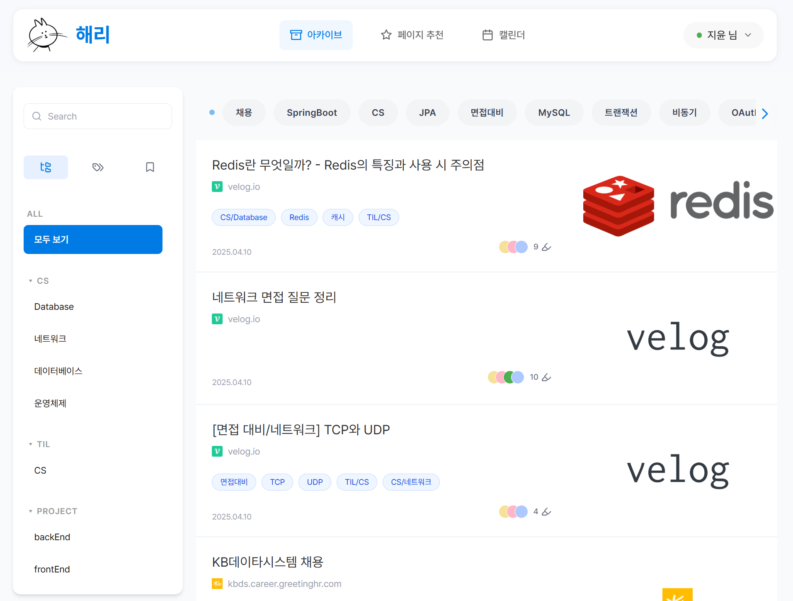

# harry - 사용자 관심사 기반 맞춤형 AI 콘텐츠 추천 서비스

## 프로젝트 개요

"harry"는 인터넷 이용이 일상화된 현대인을 위해 개발된 브라우저 확장 프로그램입니다.  
사용자의 인터넷 사용 이력을 분석하여 콘텐츠를 추천하고, 중요한 정보를 손쉽게 아카이빙하며,  
챗봇과의 상호작용을 통해 편리한 웹 경험을 제공합니다.

**한 줄 소개:** 나만의 브라우저 친구, harry  
**기능 요약:** 콘텐츠 추천, 아카이브, 챗봇

## 개발 동기

- 하루 종일 인터넷을 사용해도 컴퓨터를 끄면 무엇을 했는지 잊어버리기 쉽습니다.
- 검색 결과로 수많은 글을 열어보는 과정이 비효율적입니다.
- 인터넷 사용량이 갈수록 늘어나는 가운데, 편리한 인터넷 생활을 돕는 도구가 필요합니다.

이러한 문제를 해결하기 위해 "harry"를 개발하였습니다.

## 서비스 주요 기능

### 1. 콘텐츠 추천
- 사용자가 현재 보고 있는 페이지에서 핵심 키워드를 추출합니다.
- 추출된 키워드를 기반으로 Google Search Engine 및 Google Custom Search API를 활용하여 관련 콘텐츠를 추천합니다.
    - 예시 : 젯슨 나노 리뷰 블로그를 보면, 관련 콘텐츠 추천으로 공식 사이트의 젯슨 나노 상세 스펙 페이지가 추천됩니다.
- 핵심 기술: YAKE, KeyBERT, Transformer(6-layer), mecab을 이용한 키워드 최적 추출

### 2. 아카이브
- 사용자가 현재 열람 중인 페이지의 중요한 부분을 하이라이트하고 스크랩할 수 있습니다.
- 개인 아카이브를 관리하며 필요한 정보를 쉽게 찾아볼 수 있습니다.

### 3. 챗봇
- harry와 자연스러운 대화를 통해 일정을 기록하거나 메모를 작성할 수 있습니다.
- 사용자의 감정을 분석하여 감정 기반 대화도 지원합니다.

## 기술 스택

| 구분        | 사용 기술 |
|-------------|-----------|
| 프론트엔드  | React, TypeScript, VanillaJS, TailwindCSS, zustand |
| 백엔드      | Spring Boot, Java, FastAPI, Python |
| 데이터베이스 | MariaDB, MySQL Workbench |
| 인프라      | AWS EC2, Docker, Docker Compose, Jenkins, NginX, DockerHub |
| 외부 API    | Google OAuth2, Google Custom Search API, Gemini API |
| AI/NLP      | YAKE, KeyBERT, Transformer(6-layer), mecab |

## 프로젝트 담당자

| 이름    | 담당 업무 |
|---------|-----------|
| 노가빈  | AI 기반 맞춤형 콘텐츠 추천, QA, FE 보조 |
| 김나영  | Infra, 콘텐츠추천 메인페이지 UI |
| 김지윤  | 아카이브 CRUD, 메인 아카이브 페이지 UI |
| 이준호  | 크롬 익스텐션 개발(BE, FE) |
| 홍지우  | JWT 기반 인증 구현, 챗봇 UI |
| 허성준  | Gemini 기반 LAG 챗봇 개발, 서비스 소개 페이지 UI |

## 개발 일정

>
> 

## 프로젝트 디렉터리 구조

```plaintext
📦 harry
┣ 📂AI                  # AI 서버 (FastAPI 기반), 추천, 챗봇 모듈
┃ ┣ 📂chatbot           # 감정 분석, 일정 기록, 메모 기능
┃ ┣ 📂chrome_extension # 크롬 확장 기능 (백그라운드/컨텐츠 스크립트)
┃ ┣ 📂history           # 사용자 기록 저장 모듈
┃ ┣ 📂recommend         # 키워드 추출 및 콘텐츠 추천 엔진
┃ ┣ 📂static            # 정적 파일 (이미지, 단어 필터)
┃ ┣ 📂temp              # 임시 테스트용 모듈
┃ ┣ 📜main.py           # FastAPI 메인 서버 실행 파일
┣ 📂backend             # 백엔드(Spring Boot 기반), API 서버
┃ ┣ 📂config            # Spring 설정 (JPA, Security 등)
┃ ┣ 📂domain            # 도메인별 Controller, Service, Repository
┃ ┣ 📂global            # 전역 Exception, JWT, OAuth 설정
┃ ┣ 📜application.yaml  # Spring 설정 파일
┣ 📂extension           # 크롬 확장 프로그램 (React 기반 화면)
┃ ┣ 📂public            # 아이콘, 이미지 리소스
┃ ┣ 📂src               # 기능별 컴포넌트 및 페이지 구현
┃ ┣ 📜manifest.json     # 크롬 확장 매니페스트 설정
┣ 📂frontend            # 웹 프론트엔드 메인 (React + Vite 기반)
┃ ┣ 📂components        # UI 컴포넌트
┃ ┣ 📂pages             # 메인 페이지 및 상세 페이지
┃ ┣ 📂services          # API 호출 서비스 모듈
┃ ┣ 📂store             # 전역 상태관리(zustand)
┃ ┣ 📂layouts           # 레이아웃 컴포넌트
┃ ┣ 📜App.jsx           # 메인 App 컴포넌트
┣ 📂exec                # ERD, 시스템설계도, 명세서 파일
┣ 📜docker-compose.yml  # 통합 서비스 Docker 구성 파일
┣ 📜README.md           # 프로젝트 설명 문서
```

---

## 디렉터리 구조 요약

- **AI/** : FastAPI 서버 + 추천/챗봇/기록 분석 기능
- **backend/** : Spring Boot 백엔드 API 서버
- **extension/** : 크롬 확장 프로그램용 소스
- **frontend/** : 메인 웹 페이지(React)
- **exec/** : 시스템 설계, 기능 명세, ERD 자료
- **root** : Docker, Jenkins, 기본 설정 파일


## 시스템 아키텍처

>
> 

## ERD

>
> 

## 서비스 플로우

> 서비스 흐름도 삽입 예정
>
> 

## 주요 스크린샷

| 메인화면 | 로그인 전 메인화면 |
|:--------:|:----------------:|
|  |  |

| 메인 콘텐츠 추천 화면 | 추천 콘텐츠 화면 |
|:--------:|:----------------:|
|  |  |

| 아카이브 목록 화면 | 아카이브 상세 화면 |
|:------------------:|:------------------:|
|  |  |

| 챗봇 메인화면 | 챗봇 감정 분석 화면 |
|:-------------:|:------------------:|
|  |  |


## 트러블슈팅

### 키워드 추출 최적화

- 다양한 라이브러리(YAKE, KeyBERT, Transformer, mecab)를 조합하여 테스트를 진행했습니다.
- 정확도, 속도, 사용성 기준으로 수십 가지 조합을 비교 평가한 결과,  
  **"Transformer(6-layer) + mecab" 기반 최적 조합**을 선정했습니다.
- 이를 통해 사용자의 웹 활동 이력을 빠르고 정확하게 분석할 수 있었습니다.

## 설치 및 실행 방법

### Chrome 확장 프로그램 설치

1. 크롬 브라우저를 엽니다.
2. `chrome://extensions/` 에 접속합니다.
3. "개발자 모드"를 활성화합니다.
4. `extension/` 폴더를 압축 해제한 후 "압축 해제된 확장 프로그램 로드"를 클릭하여 폴더를 선택합니다.


## 향후 개선 방향

- 추천 알고리즘에 개인화 강화 (예: 사용자의 피드백 반영)
- 사용자 UX 최적화
- 다국어 지원 확대
- 모바일 웹 확장 가능성 검토

---

# 끝까지 읽어주셔서 감사합니다.

"harry"는 계속해서 성장 중입니다.  
여러분의 편리한 웹 생활을 위해 끊임없이 발전해 나가겠습니다.
